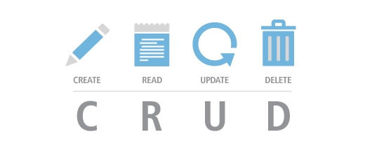

<p align="center">
  <a href="" rel="noopener">
 </a>
</p>

<h3 align="center">A CRUD with Express and MongoDB</h3>

<div align="center">

[]()

</div>

---

<p align="center"> This project is a CRUD with Express and MongoDB.
    <br> 
</p>

## 📝 Table of Contents

- [About](#about)
- [Getting Started](#getting_started)
- [Structures](#structures)
- [Built Using](#built_using)
- [Authors](#authors)

## 🧐 About <a name = "about"></a>

About the Project

## 🏁 Getting Started <a name = "getting_started"></a>

These instructions will get you a copy of the project up and running on your local machine for development and testing purposes. See [deployment](#deployment) for notes on how to deploy the project on a live system.

### Prerequisites & Installing

What things you need to install the software and how to install them.

```
Give examples
```

### Runing & Usage

A step by step series of examples that tell you how to get a development env running.

Say what the step will be

```
Give the example
```

And repeat

```
until finished
```

End with an example of getting some data out of the system or using it for a little demo.


## 📁 Structures <a name="structures"></a>

### This is how the Project is structured.

```
app/
├─ node_modules/
├─ src/
│  └─ app/
│     └─ controllers/
│     └─ middlewares/
│     └─ models/
│  └─ config/
│     └─ auth.json
│  └─ database/
│     └─ index.js
│  └─ modules/
│     └─ XXXX.js
├─ .gitignore
├─ index.js
├─ package.json
├─ README.md
└─ yarn.lock
```

## ⛏️ Built Using <a name = "built_using"></a>

- [MongoDB](https://rnfirebase.io/) - MongoDB
- [NodeJS](https://reactnative.dev/) - NodeJS
- [NodeJS](https://reactnative.dev/) - ExpressJS


## ✍️ Authors <a name = "authors"></a>

- [@joaorjoaquim](https://github.com/joaorjoaquim) - Idea & Initial work
